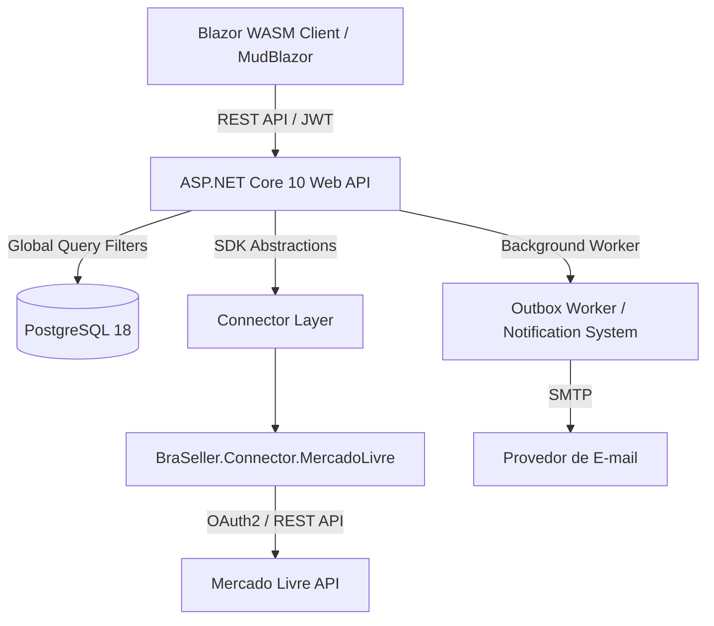

# Visão Geral do Sistema

> [!NOTE]
> O **BraSeller** é uma plataforma SaaS desenvolvida para resolver as dores da gestão financeira, conciliação e apuração tributária de e-commerces que vendem em múltiplos marketplaces.

---

## 🎯 Objetivo do Sistema

Vendedores de e-commerce enfrentam grande complexidade para rastrear a margem real de suas vendas devido a:
1. Retenções automáticas de taxas por plataformas como Mercado Livre, Shopee e Amazon.
2. Variações de custos de frete e campanhas de anúncios.
3. Necessidade de conciliação de repasses bancários em relação ao faturamento fiscal.
4. Isolamento rígido de dados entre múltiplas empresas/lojas (Multi-Tenancy).

O **BraSeller** centraliza todas essas operações em uma arquitetura segura, expansível e performática.

---

## 🏛️ Arquitetura Geral

---

## 🧩 Solução Multi-Projeto

O repositório é organizado em projetos de responsabilidades bem definidas:

1. **`MudBlazorWebApp1`**: Aplicação principal ASP.NET Core contendo Web API, Hosted Services, inicialização do Blazor Server/Prerender e regras de infraestrutura.
2. **`MudBlazorWebApp1.Client`**: Frontend Blazor WebAssembly interativo com componentes MudBlazor e serviços de visualização.
3. **`BraSeller.Connectors.Abstractions`**: SDK isolado sem dependências de infraestrutura que define os contratos para qualquer conector de marketplace (`IMarketplaceConnector`, `IConnectorModule`, `ConnectorDescriptor`).
4. **`BraSeller.Connector.MercadoLivre`**: Plugin concreto para a plataforma Mercado Livre.
5. **`MudBlazorWebApp1.Tests`**: Suíte de testes unitários e de integração com WebApplicationFactory.
6. **`infrastructure`**: Arquivos de automação de infraestrutura com Docker Compose e Terraform.

---

## 🔗 Contextos Ligados

- [[01 - 🏗️ Arquitetura & Visão Geral/Clean Architecture & Structuring|Clean Architecture & Structure]]
- [[02 - 🔒 Segurança & Multi-Tenancy/Multi-Tenant Model & Query Filters|Isolamento Multi-Tenant]]
- [[03 - 🔌 SDK & Conectores Marketplace/SDK de Conectores (Abstractions)|SDK de Conectores]]

#arquitetura #visao-geral #dotnet10 #blazor #multitenant
