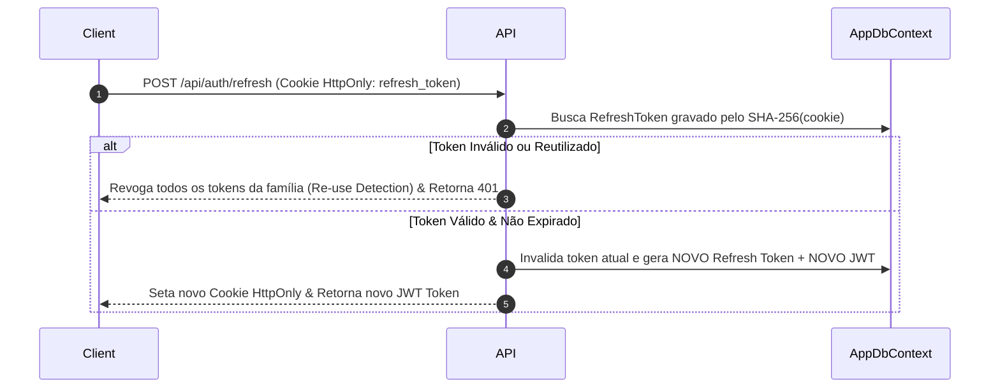

# Autenticação JWT & Refresh Tokens

> [!NOTE]
> A autenticação do **BraSeller** utiliza **JWT (JSON Web Token)** de vida curta para acesso stateless às APIs e **Refresh Tokens de 512 bits** com rotação automática trafegados em cookies seguros `HttpOnly`.

---

## 🔑 Estrutura dos Tokens

### Access Token (JWT)
- **Algoritmo**: HMAC-SHA256
- **Validade**: 10 minutos (curta duração para mitigar roubo de token)
- **Claims**:
  - `sub`: ID do Usuário (Guid)
  - `email`: E-mail do usuário
  - `tenant_id`: ID do Tenant (Guid)
  - `role`: Papel do usuário (`Admin`, `Vendedor`, `Contador`)
  - `security_stamp`: Stamp para revogação imediata de token

### Refresh Token
- **Tamanho**: 512 bits aleatórios gerados por `RandomNumberGenerator`
- **Armazenamento no Banco**: Gravado **apenas como Hash SHA-256** na tabela `RefreshTokens` (nunca em texto claro).
- **Armazenamento no Cliente**: Transportado via cookie HTTP:
  - `HttpOnly = true` (Inacessível por JavaScript / Ataques XSS)
  - `Secure = true` (Trafegado apenas via HTTPS)
  - `SameSite = SameSiteMode.Strict` (Proteção contra CSRF)

---

## 🔄 Fluxo de Rotação de Refresh Token

---

## ⚡ Invalidação Imediata (Security Stamp)

Quando um administrador:
- Altera a função (`Role`) de um usuário
- Desativa um acesso
- Reseta a senha

O `SecurityStamp` do usuário na tabela `AspNetUsers` é atualizado. Na validação de requisições do JWT ou no refresh de token, tokens antigos com `security_stamp` divergente são rejeitados instantaneamente.

---

## 🔗 Links Relacionados

- [[02 - 🔒 Segurança & Multi-Tenancy/Multi-Tenant Model & Query Filters|Isolamento Multi-Tenant]]
- [[02 - 🔒 Segurança & Multi-Tenancy/Roles, Policies & Permissões|Roles & Permissões]]
- [[06 - 🛠️ Guia de Desenvolvimento & API/Catalogo de APIs|Catálogo de APIs]]

#security #jwt #refreshtoken #httponly #auth #aspnetcore
