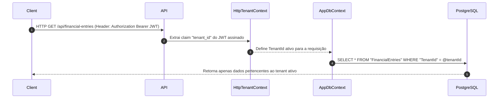

# Multi-Tenant Model & Query Filters

> [!IMPORTANT]
> O isolamento de dados entre diferentes empresas (Tenants) é o pilar de segurança mais crítico do **BraSeller**. Toda consulta e alteração no banco de dados é estritamente escopada ao tenant autenticado.

---

## 🔒 Princípio de Isolamento

O cliente (navegador/frontend) **nunca escolhe** o `tenant_id` de uma consulta. O `tenant_id` é extraído exclusivamente da claim assinada no Token JWT durante a autenticação.



---

## 🛠️ Implementação Técnica

### 1. Entidade de Inquilino (`ITenantEntity`)

Todas as entidades multilocatárias implementam a interface `ITenantEntity`:

```csharp
public interface ITenantEntity
{
    Guid TenantId { get; set; }
}
```

### 2. Contexto de Tenant (`ITenantContext` / `HttpTenantContext`)

O `HttpTenantContext` obtém o `tenant_id` do `HttpContext.User` via claim `tenant_id`. Também permite alterar temporariamente o escopo via `ITenantScope` (ex: background workers).

```csharp
public sealed class HttpTenantContext(IHttpContextAccessor accessor) : ITenantScope
{
    public Guid? TenantId
    {
        get
        {
            if (_scopedTenantId.HasValue) return _scopedTenantId;
            var value = accessor.HttpContext?.User.FindFirstValue("tenant_id");
            return Guid.TryParse(value, out var id) ? id : null;
        }
    }
}
```

### 3. Filtro Global no EF Core (`AppDbContext`)

No método `OnModelCreating`, o EF Core aplica dinamicamente um filtro global (`HasQueryFilter`) em todas as entidades que implementam `ITenantEntity`:

```csharp
foreach (var entityType in builder.Model.GetEntityTypes())
{
    if (typeof(ITenantEntity).IsAssignableFrom(entityType.ClrType))
    {
        builder.Entity(entityType.ClrType)
               .HasQueryFilter(ConvertTenantFilter(entityType.ClrType));
    }
}
```

### 4. Proteção na Escrita (`SaveChanges`)

No `SaveChangesAsync`, o `AppDbContext` valida e força que qualquer nova entidade que implemente `ITenantEntity` receba o `TenantId` do contexto atual, prevenindo gravações acidentais em outros tenants:

```csharp
foreach (var entry in ChangeTracker.Entries<ITenantEntity>())
{
    if (entry.State == EntityState.Added)
    {
        entry.Entity.TenantId = tenantContext.TenantId 
            ?? throw new InvalidOperationException("TenantContext is required for adding tenant entities.");
    }
}
```

---

## 🔗 Links Relacionados

- [[02 - 🔒 Segurança & Multi-Tenancy/Autenticação JWT & Refresh Tokens|Autenticação JWT]]
- [[02 - 🔒 Segurança & Multi-Tenancy/Roles, Policies & Permissões|Roles & Permissões]]
- [[05 - 🗄️ Banco de Dados & Infraestrutura/Modelo de Dados PostgreSQL|Modelo PostgreSQL]]

#security #multi-tenancy #efcore #tenant-isolation #aspnetcore
