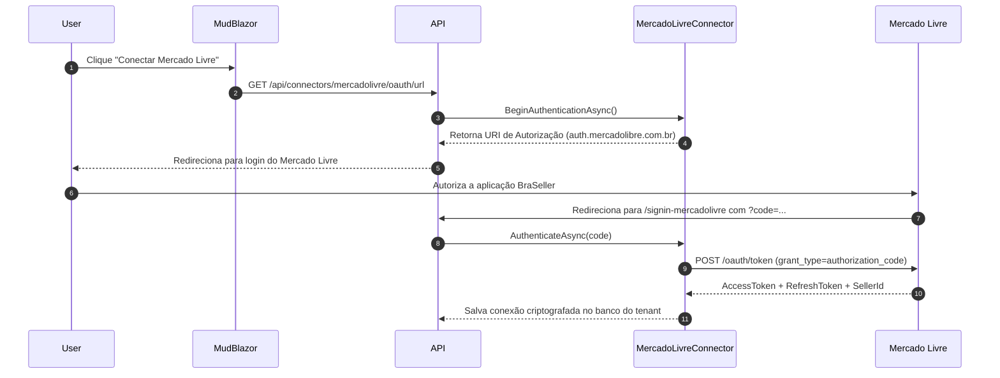

# Conector Mercado Livre

> [!NOTE]
> O plugin **`BraSeller.Connector.MercadoLivre`** é a implementação concreta oficial para sincronização de vendas, pagamentos, tarifas de venda/frete e conciliação com a API do Mercado Livre.

---

## 🛠️ Arquitetura do Plugin

O conector implementa `IMarketplaceConnector` e `IOAuthMarketplaceConnector` para lidar com a autenticação OAuth2 do Mercado Livre e gerenciar o Rate Limiting exigido pela plataforma.

### Componentes Principais
- `MercadoLivreConnector.cs`: Lógica principal de comunicação HTTP com endpoints do Mercado Livre (`/orders/search`, `/billing/integration/group/ML/order/*`, etc.).
- `MercadoLivreModule.cs`: Registra o conector no container DI do ASP.NET Core (`IConnectorModule`).
- `MercadoLivreRateLimiter.cs`: Limita requisições por segundo utilizando `System.Threading.RateLimiting.TokenBucketRateLimiter` para respeitar a cota da API do Mercado Livre.
- `MercadoLivreOptions.cs`: Configurações de `AppId`, `SecretKey` e URLs de callback OAuth.

---

## 🔄 Fluxo de Autenticação OAuth2

---

## ⚙️ Sincronização & Normalização

Ao sincronizar pedidos (`SyncAllAsync`), o conector transforma a resposta JSON bruta do Mercado Livre nos registros imutáveis normalizados `StandardOrder`, `StandardPayment` e `StandardFee`:

- **Tarifa de Venda (`listing_fee`)**: Identificada e categorizada como tarifa de marketplace.
- **Custo de Envio (`shipping_cost`)**: Identificado separadamente do valor bruto.
- **Liberacao de Dinheiro (`money_release_date`)**: Mapeado para prever o fluxo de caixa do vendedor.

---

## 🔗 Links Relacionados

- [[03 - 🔌 SDK & Conectores Marketplace/SDK de Conectores (Abstractions)|SDK de Conectores]]
- [[04 - 💼 Módulos de Negócio/Reconciliação Financeira|Reconciliação Financeira]]

#mercadolivre #plugin #connector #oauth2 #ratelimit
