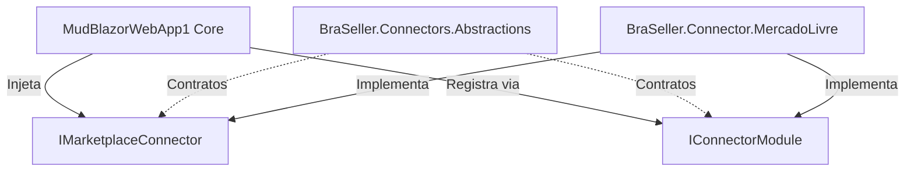

# SDK de Conectores (Abstractions)

> [!IMPORTANT]
> O projeto **`BraSeller.Connectors.Abstractions`** é o único assembly que um módulo de marketplace deve referenciar. O Core da aplicação **não possui referências concretas** para Mercado Livre, Shopee ou Amazon.

---

## 🎯 Objetivo do SDK

Isolar completamente as regras e detalhes de comunicação de cada plataforma de marketplace através de contratos C# fortemente tipados e registros imutáveis (`records`).



---

## 📋 Principais Interfaces & Records

### 1. `IMarketplaceConnector`
Interface principal que todo plugin de marketplace deve implementar:

```csharp
public interface IMarketplaceConnector
{
    ConnectorDescriptor Descriptor { get; }
    Task<ConnectorAuthentication> AuthenticateAsync(AuthenticationRequest request, CancellationToken cancellationToken = default);
    Task<ConnectorAuthentication> RefreshTokenAsync(RefreshTokenRequest request, CancellationToken cancellationToken = default);
    Task<ConnectorPage<StandardOrder>> GetOrdersAsync(ConnectorContext context, OrderFilter filter, CancellationToken cancellationToken = default);
    Task<StandardOrder> GetOrderDetailAsync(ConnectorContext context, string orderId, CancellationToken cancellationToken = default);
    Task<IReadOnlyCollection<StandardPayment>> GetPaymentsAsync(ConnectorContext context, string orderId, CancellationToken cancellationToken = default);
    Task<IReadOnlyCollection<StandardFee>> GetFeesAsync(ConnectorContext context, string orderId, CancellationToken cancellationToken = default);
    IAsyncEnumerable<StandardOrder> SyncAllAsync(ConnectorContext context, DateTimeOffset since, CancellationToken cancellationToken = default);
    Task<ConnectorStatus> GetStatusAsync(ConnectorContext context, CancellationToken cancellationToken = default);
}
```

### 2. `IConnectorModule`
Contrato para auto-registro de serviços do conector na Injeção de Dependências do ASP.NET Core:

```csharp
public interface IConnectorModule
{
    void Register(IServiceCollection services, IConfiguration configuration);
}
```

### 3. `ConnectorDescriptor` & `ConnectorCredentialField`
Metadados dinâmicos fornecidos pelo conector para que a interface (MudBlazor) construa formulários de autenticação sem conhecer os campos específicos da API do marketplace:

```csharp
public sealed record ConnectorDescriptor(
    string Name,
    string DisplayName,
    string Version,
    bool SupportsInvoices = false,
    IReadOnlyCollection<ConnectorCredentialField>? CredentialFields = null,
    bool UsesOAuth = false);

public sealed record ConnectorCredentialField(
    string Name,
    string Label,
    bool Secret = false,
    bool Required = true);
```

---

## 🔗 Links Relacionados

- [[03 - 🔌 SDK & Conectores Marketplace/Conector Mercado Livre|Conector Mercado Livre]]
- [[03 - 🔌 SDK & Conectores Marketplace/Guia de Implementação de Novo Conector|Guia de Novo Conector]]

#sdk #connectors #abstractions #architecture #dotnet
