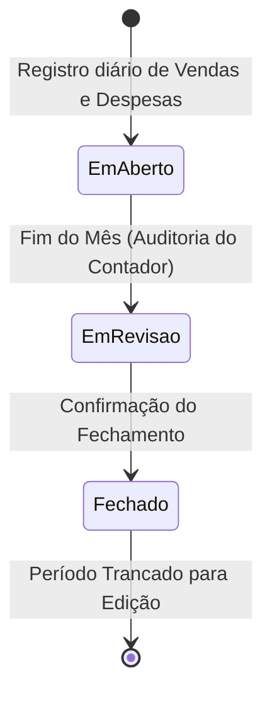

# Contabilidade & Fechamento de Período

> [!IMPORTANT]
> O módulo de **Contabilidade & Fechamento de Período** (`PeriodClosing`) garante a integridade dos dados contábeis de meses anteriores, impedindo alterações retroativas de lançamentos financeiros após a auditoria do Contador.

---

## 🔒 Travamento de Período (`PeriodClosing`)

Quando o perfil **`Contador`** ou **`Admin`** encerra um período contábil (ex: Mês de Janeiro/2026):

1. **Snapshot de Balancete e DRE**: O sistema consolida as receitas, custos das mercadorias (CMV), tarifas de marketplace e despesas operacionais.
2. **Bloqueio de Mutação**: Qualquer tentativa de alteração (`INSERT`, `UPDATE`, `DELETE`) em movimentações financeiras com data dentro do período fechado é rejeitada com erro no `AppDbContext`.
3. **Log de Auditoria**: Gera uma trilha imutável com o hash de validação dos valores contábeis.

---

## 👨‍💼 Workflow do Perfil `Contador`

O usuário com papel `Contador`:
- Possui visualização dedicada dos demonstrativos contábeis (`DRE`, Balancete de Verificação, Razão Auxiliar).
- Pode exportar os relatórios no formato PDF para conferência física ou suporte à declaração do Simples Nacional / Lucro Presumido.
- Possui permissão restrita de leitura (não pode alterar valores ou adicionar lançamentos manuais).

---

## 🔗 Links Relacionados

- [[02 - 🔒 Segurança & Multi-Tenancy/Roles, Policies & Permissões|Roles & Permissões]]
- [[04 - 💼 Módulos de Negócio/Relatórios & Exportação (PDF, Excel, CSV)|Exportação de PDF & Excel]]
- [[04 - 💼 Módulos de Negócio/Módulo Fiscal|Módulo Fiscal]]

#contabilidade #fechamento #dre #auditoria #contador
