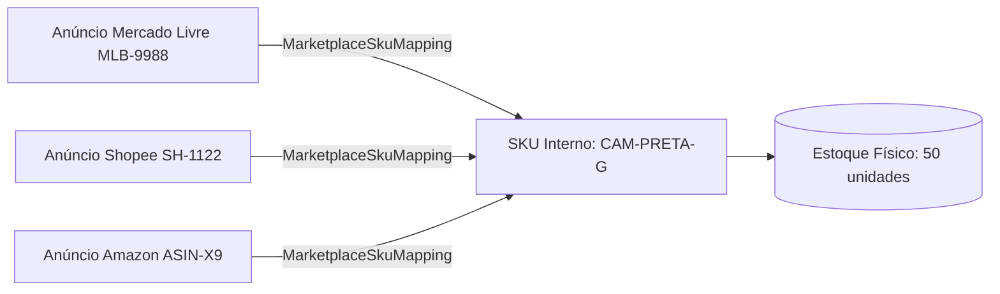

# Gestão de Estoque

> [!NOTE]
> O módulo de **Gestão de Estoque** (`Inventory`) realiza o rastreamento unificado de saldos físicos de produtos, vinculando os SKUs de múltiplos marketplaces aos produtos cadastrados no tenant.

---

## 📦 Estrutura do Módulo de Estoque

### 1. Item de Estoque (`InventoryItem`)
Representa o produto real no estoque do vendedor com:
- SKU interno
- Nome e descrição
- Custo de Aquisição (utilizado para cálculo automático de CMV na DRE)
- Saldo físico e saldo reservado

### 2. Mapeamento de SKUs (`MarketplaceSkuMapping`)
Faz a ponte entre o SKU do anúncio no marketplace (ex: Mercado Livre MLB123456) e o SKU interno da empresa:

---

## 🔄 Movimentações de Estoque (`InventoryMovement`)

Toda entrada ou saída registra uma movimentação imutável com o tipo:
- `Venda`: Baixa automática efetuada na importação do pedido.
- `Devolução`: Retorno ao saldo físico por cancelamento/estorno.
- `AjusteManual`: Correção de inventário por avaria ou contagem física.
- `EntradaNota`: Entrada de mercadoria via Nota Fiscal de Fornecedor.

---

## 🔗 Links Relacionados

- [[04 - 💼 Módulos de Negócio/Reconciliação Financeira|Reconciliação Financeira]]
- [[04 - 💼 Módulos de Negócio/Módulo Fiscal|Módulo Fiscal]]

#estoque #inventory #sku #cmv #multichannel
