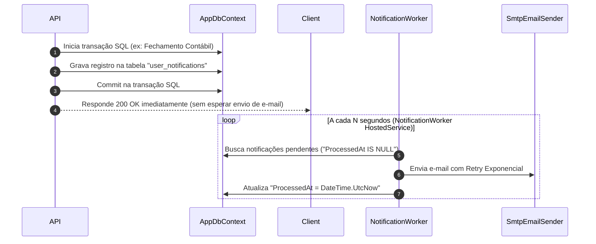

# Notificações & Outbox Pattern

> [!IMPORTANT]
> Para garantir que o envio de e-mails e alertas não trave a resposta das requisições nem perca mensagens durante falhas de rede, o **BraSeller** utiliza o padrão **Transactional Outbox** em segundo plano.

---

## 📬 Padrão Transactional Outbox



---

## ⚙️ Tipos de Notificações & Deduplicação

1. **Fechamento Mensal**: Alerta enviado ao Contador quando um período é fechado.
2. **Liberação de Saldo ML**: Alerta de repasses disponíveis no Mercado Pago.
3. **Novas Vendas**: Resumo diário/semanal configurável.
4. **Relatório Semanal**: Envio automático de relatórios em anexo para o Contador.

### Deduplicação
Cada notificação gera uma chave única de deduplicação (`DeduplicationKey`). Se o mesmo evento for disparado duas vezes no mesmo segundo, o banco rejeita a duplicidade via restrição de índice.

---

## ✉️ Configuração do Provedor SMTP

As credenciais do provedor de e-mail são configuradas via variáveis de ambiente ou secret manager:

```text
Email__Enabled=true
Email__Host=smtp.seu-provedor.com
Email__Port=587
Email__Username=notificacoes@seu-dominio.com
Email__Password=...
Email__FromEmail=notificacoes@seu-dominio.com
Email__FromName=BraSeller
Email__Security=StartTls
```

---

## 🔗 Links Relacionados

- [[01 - 🏗️ Arquitetura & Visão Geral/Tech Stack & Decisões Tecnológicas|Tech Stack]]
- [[06 - 🛠️ Guia de Desenvolvimento & API/Setup Local & Variáveis de Ambiente|Setup Local]]

#outbox #notifications #smtp #backgroundservice #email
