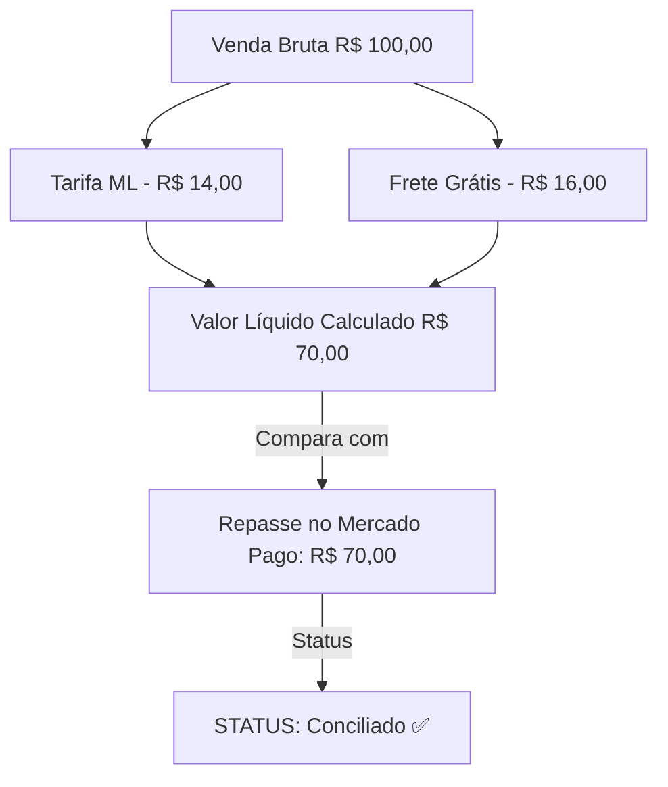

# Reconciliação Financeira

> [!NOTE]
> O módulo de **Reconciliação Financeira** cruza automaticamente os valores brutos de vendas informados nas plataformas com os repasses efetivamente depositados e as taxas cobradas pelos marketplaces.

---

## 📊 Funcionamento do Motor de Conciliação

O motor de conciliação analisa três componentes fundamentais:
1. **Valor Bruto da Venda (`GrossAmount`)**: O preço total pago pelo cliente final.
2. **Tarifas da Plataforma (`MarketplaceFee`)**: Comissão da plataforma + taxa fixa por item + custo de frete do vendedor.
3. **Repasse Líquido (`NetValue`)**: O saldo esperado a ser liberado na conta corrente do vendedor na data estipulada (`ReleaseDate`).

---

## 🛠️ Regras & Divergências Detectadas

Se o valor depositado ou o prazo de liberação divergirem do calculado pelas regras contratuais, o sistema sinaliza pendências no painel:

- ⚠️ **Divergência de Comissão**: Quando a comissão cobrada excede a alíquota acordada da categoria.
- ⚠️ **Divergência de Frete**: Quando a cobrança de frete da plataforma difere do peso/tamanho real do produto.
- ⚠️ **Atraso no Repasse**: Quando a data limite de liberação (`ReleaseDate`) expira sem o evento de confirmação bancária.

---

## 🔗 Links Relacionados

- [[04 - 💼 Módulos de Negócio/Contabilidade & Fechamento de Período|Contabilidade]]
- [[04 - 💼 Módulos de Negócio/Relatórios & Exportação (PDF, Excel, CSV)|Exportação de Relatórios]]
- [[03 - 🔌 SDK & Conectores Marketplace/Conector Mercado Livre|Conector Mercado Livre]]

#reconciliacao #financeiro #marketplaces #fluxodecaixa #dre
