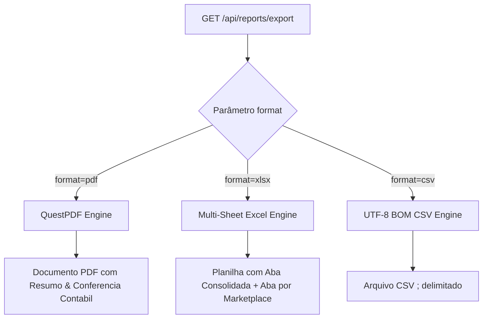

# Relatórios & Exportação (PDF, Excel, CSV)

> [!NOTE]
> O endpoint `GET /api/reports/export` disponibiliza a geração de relatórios filtrados por período, marketplace, forma de pagamento e status da transação.

---

## 🖨️ Formatos Suportados



---

## 📄 Especificações Técnicas de Cada Formato

### 1. Documento PDF (`format=pdf`)
- Gerado com **QuestPDF (Community License)**.
- Inclui cabeçalho do Tenant, CNPJ, período selecionado, gráfico de resumo mensal de faturamento e tabela detalhada de conferência contábil com subtotais de taxas e repasse líquido.

### 2. Planilha Excel (`format=xlsx`)
- **Aba Consolidada**: Visão unificada de todos os marketplaces.
- **Abas Individuais**: Uma aba para Mercado Livre, uma para Shopee, Amazon, etc.
- **Formatação**: Valores monetários pré-formatados em `R$ #,##0.00` e datas em `dd/MM/yyyy HH:mm`.

### 3. Arquivo CSV (`format=csv`)
- Codificação **UTF-8 com BOM** (Byte Order Mark) para garantia de abertura correta de acentos no Microsoft Excel sem desconfigurar.
- Separador de colunas: Ponto e vírgula (`;`).
- Formato numérico invariavel (`InvarientCulture` com ponto decimal).

---

## 🔒 Licenciamento QuestPDF

O arquivo `appsettings.json` ou variáveis de ambiente configuram a licença:

```json
"Reports": {
  "QuestPdfLicense": "Community"
}
```

> [!WARNING]
> Antes do uso comercial em larga escala, verifique os critérios de elegibilidade da licença Community do QuestPDF no site oficial da biblioteca.

---

## 🔗 Links Relacionados

- [[04 - 💼 Módulos de Negócio/Contabilidade & Fechamento de Período|Contabilidade]]
- [[06 - 🛠️ Guia de Desenvolvimento & API/Catalogo de APIs|Catálogo de APIs]]

#reports #pdf #questpdf #excel #csv #exportacao
