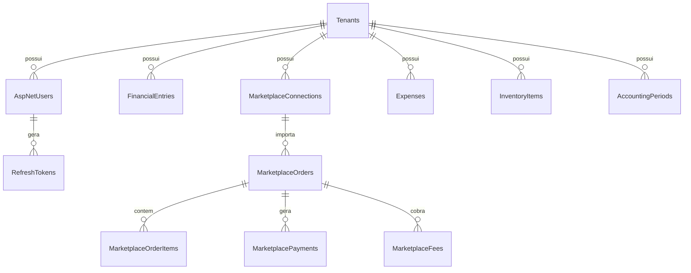

# Modelo de Dados PostgreSQL 18

> [!NOTE]
> O **BraSeller** utiliza o **PostgreSQL 18** como seu banco de dados relacional primário. Todas as tabelas de negócio possuem a coluna `TenantId` indexada como chave estrangeira para a tabela `Tenants`.

---

## 🗄️ Esquema Simplificado do Banco de Dados

---

## 📋 Principais Tabelas & Tipos de Dados

| Tabela | Descrição | Principais Colunas | Índices Críticos |
|---|---|---|---|
| `Tenants` | Cadastro de Inquilinos | `Id`, `Name`, `CreatedAt` | `PK_Tenants` |
| `AspNetUsers` | Usuários do sistema | `Id`, `TenantId`, `Email`, `DisplayName`, `SecurityStamp` | `IX_AspNetUsers_TenantId` |
| `RefreshTokens` | Tokens de renovação | `Id`, `TenantId`, `UserId`, `TokenHash`, `ExpiresAt` | `IX_RefreshTokens_TokenHash` (Unique), `IX_RefreshTokens_TenantId_UserId` |
| `FinancialEntries` | Lançamentos financeiros | `Id`, `TenantId`, `ExternalId`, `GrossAmount`, `NetAmount` | `IX_FinancialEntries_TenantId_Date` |
| `MarketplaceConnections` | Credenciais conectadas | `Id`, `TenantId`, `MarketplaceName`, `EncryptedAccessToken` | `IX_MarketplaceConnections_TenantId` |
| `AccountingPeriods` | Períodos fechados | `Id`, `TenantId`, `Year`, `Month`, `IsClosed`, `ClosedAt` | `IX_AccountingPeriods_TenantId_Year_Month` |

---

## 🔒 Precisão Numérica Monetária

Todas as colunas relativas a valores financeiros (`GrossAmount`, `NetAmount`, `PlatformFee`, `TaxRate`) utilizam o tipo SQL `decimal(18,2)` ou `decimal(18,4)` no EF Core para evitar imprecisão de arredondamento de ponto flutuante.

---

## 🔗 Links Relacionados

- [[02 - 🔒 Segurança & Multi-Tenancy/Multi-Tenant Model & Query Filters|Isolamento Multi-Tenant]]
- [[05 - 🗄️ Banco de Dados & Infraestrutura/EF Core & Migrations|EF Core & Migrations]]

#database #postgresql #schema #er-diagram #efcore
