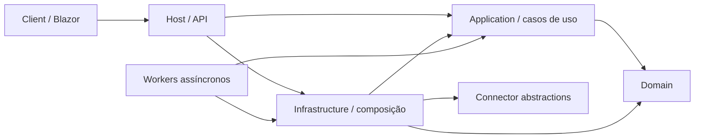

# Arquitetura escalável do BraSeller

## Decisão

O sistema adota um **monólito modular**, organizado por fatias verticais e com
dependências inspiradas em Clean Architecture. Ele continua sendo implantado como
uma unidade, mas seus módulos têm limites claros para permitir testes isolados,
escala horizontal do host e extração gradual de workers ou serviços.

Essa é uma decisão deliberada, não uma etapa incompleta rumo a microsserviços.
Microsserviços só serão introduzidos quando houver necessidade comprovada de
implantação, escala, disponibilidade ou ownership independentes.

## Comparação das abordagens

| Abordagem | Vantagem principal | Custo/risco | Adequação atual |
| --- | --- | --- | --- |
| Projeto único tudo-em-um | Entrega inicial simples | Acoplamento cresce rapidamente; limites apenas convencionais | Insuficiente para a quantidade atual de domínios |
| N camadas tradicional | Responsabilidades familiares (UI, negócio, dados) | Dependências apontam para o banco; fatias de negócio ficam espalhadas | Útil como conceito, não como estrutura principal |
| Clean Architecture | Domínio e casos de uso independentes de detalhes externos | Mais abstrações e projetos; pode virar cerimônia | Regra de dependência adotada |
| Monólito modular + fatias verticais | Coesão por negócio, operação simples e extração gradual | Limites precisam de testes e disciplina | **Escolha atual** |
| Web-Queue-Worker | Isola trabalhos longos e absorve picos | Mensageria, idempotência e observabilidade | Já aplicável a sincronização, e-mail e tarefas assíncronas |
| Microsserviços | Escala e implantação independentes | Rede, consistência eventual, tracing, DevOps e custo operacional | Somente após métricas justificarem |

## Limites e dependências



As dependências de código apontam para dentro:

1. `Domain` contém regras e estados de negócio. Não acessa HTTP, banco, filas,
   armazenamento ou UI.
2. `Application` orquestra casos de uso e declara portas necessárias para o mundo
   externo. Não conhece implementações de infraestrutura.
3. `Infrastructure` implementa persistência, mensageria, armazenamento e clientes
   externos.
4. `Features/<Modulo>` é a fronteira de entrega HTTP da fatia vertical. Endpoints
   convertem transporte em comandos/consultas e não concentram regras.
5. `Hosting` é a raiz de composição. Pode conhecer todos os módulos, mas nenhuma
   regra de negócio deve depender dela.
6. `Client` consome contratos HTTP; não compartilha entidades persistidas.

Enquanto `Domain`, `Application` e `Infrastructure` ainda estiverem no assembly do
host, essas regras são obrigatórias por namespace. A separação em projetos deve
ser incremental, começando pelos módulos alterados com maior frequência.

## Estrutura-alvo

```text
src/
  BraSeller.Domain/
  BraSeller.Application/
    Abstractions/
    Accounting/
    Inventory/
    Reconciliation/
  BraSeller.Infrastructure/
    Persistence/
    Messaging/
    Storage/
    ExternalServices/
  BraSeller.Web/
    Features/
    Hosting/
    Components/
  BraSeller.Workers/
tests/
  BraSeller.Domain.Tests/
  BraSeller.Application.Tests/
  BraSeller.Infrastructure.Tests/
  BraSeller.Architecture.Tests/
```

Não é necessário mover todo o repositório de uma vez. Ao modificar um módulo,
move-se primeiro sua regra pura para `Domain`/`Application`, mantém-se a
implementação externa em `Infrastructure` e deixa-se no endpoint apenas o
adaptador HTTP.

## Escala de execução

- O host deve permanecer **stateless**. Sessões, chaves de Data Protection,
  arquivos e estado compartilhado não podem depender do disco local.
- PostgreSQL, S3 e RabbitMQ são recursos externos compartilhados; conexões e
  consumidores precisam ter limites, timeouts e health checks.
- O host pode ser replicado atrás de um balanceador. Migrações de banco não devem
  ser disputadas por todas as réplicas em produção; devem virar etapa única do
  pipeline.
- Trabalhos demorados, sujeitos a picos ou repetição devem ser publicados em fila.
  Consumidores devem ser idempotentes, observáveis e aceitar reentrega.
- Cache local é apenas otimização descartável. Estado que exige coerência usa
  cache distribuído ou a fonte persistente.
- Escala independente começa por `Workers`; um módulo só vira microsserviço se
  possuir fronteira de dados e contrato estável.

## Gatilhos para extrair um serviço

Considere extrair somente quando ao menos um destes sinais for mensurável:

- um módulo exige perfil de CPU/memória ou volume muito diferente do host;
- implantação independente reduz risco ou frequência de indisponibilidade;
- uma equipe possui ownership e ciclo de entrega realmente independentes;
- o módulo demanda isolamento de segurança ou disponibilidade;
- o custo de replicar o monólito excede o custo operacional da distribuição.

Antes da extração, defina contrato versionado, idempotência, ownership dos dados,
telemetria distribuída, política de retry/dead-letter e estratégia de consistência.

## Sequência de evolução

1. Manter `Program.cs` como raiz de composição e registrar endpoints por módulo.
2. Criar testes de arquitetura que impeçam dependências de `Domain/Application`
   para `Infrastructure/Hosting`.
3. Separar `Domain` e `Application` em projetos, módulo a módulo.
4. Executar migrações no pipeline e adicionar health/readiness checks.
5. Separar consumidores RabbitMQ em `BraSeller.Workers`, escaláveis por fila.
6. Medir latência, throughput, saturação e backlog antes de qualquer extração.

## Referência

Decisão baseada no guia da Microsoft:
[Arquiteturas comuns de aplicativos da Web](https://learn.microsoft.com/pt-br/dotnet/architecture/modern-web-apps-azure/common-web-application-architectures).
